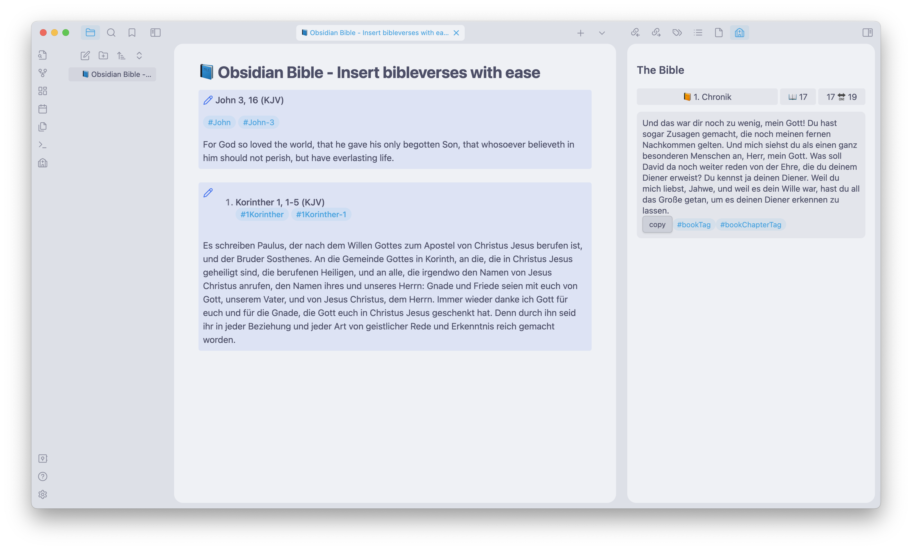
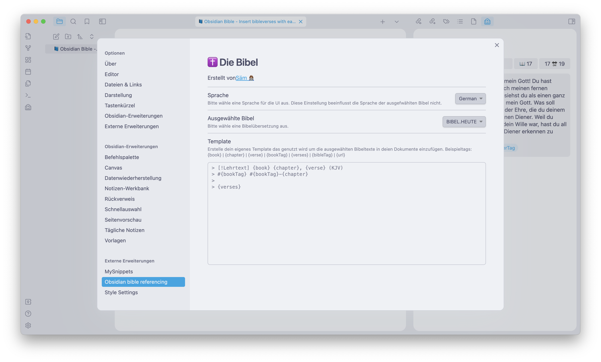
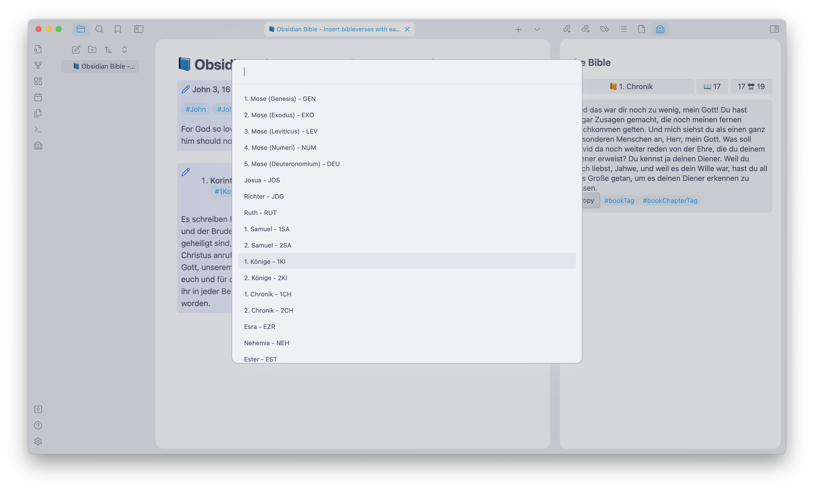

# 📘 Obsidian Bible: Insert bibleverses with ease

🔗 **Obsidian Bible** is a custom integration for Obsidian, the Markdown-based note-taking app that I've grown to love. This extension allows me to seamlessly connect my notes with verses from the Bible, making my research and study sessions more meaningful and efficient. 🔗

> Why another obsidian integration
> Other bible-apis only feature a few selected german / english bibles, most of the time, not the ones I use regularily. Therefore this integration is built upon the "YouVersion - Bible.com" website. Therefore theoretically all on the website available bibles can be used.

---

## 🌟 Embrace the Power of Knowledge 🌟

As this is a personal project mostly suited for my own workflow, I hope that you can use it as good as I do. Feel free to enhance the project with your own ideas. 

So, what are you waiting for? Lets dive right into it. 🤓

## 📖 What's Inside? 🔎

- **24 Bibles currently included:** This extension is built on top of the YouVersion website, giving you access to a vast array of bibles in multiple languages. 🌐 Check out the `bible.json` file to see the available keys. 
If your favourite bible is missing, just open a PR and add it there 🤓. 

- **Multi-Language Interface:** Currently, we're supporting English and German, but the interface can be easily translated to other languages! 🇬🇧🇺🇸

- **Custom Templating Engine:** With this feature, you can customize how the inserted Bible verses are displayed. Choose your preferred format and make your notes truly unique! 🎨

- **Command Action for easily inserting Verses:** With the configured action it is easily possible to insert the bible verses you need quickly into your note. The search also has some kind of auto-suggestions.

- **Quick Reference System:** The ItemView on the right sidebar lets you quickly look up references of other verses, making your research and study sessions more efficient. 🔍

---

## 🚀 Getting Started 🚀

1. **Installation:** To get started, simply install the `Obsidian Bible referencing` plugin from the [Obsidian Plugin Marketplace](marketplace-link). 📦

2. **Configuration:** After installation, head to the **Settings** tab in Obsidian and search for `Obsidian Bible referencing`. Here, you can configure your preferred Bible and customize the templating engine. 🌇

---

Questions or comments? Feel free to open an issue here on Github. I am always here to help! 😊